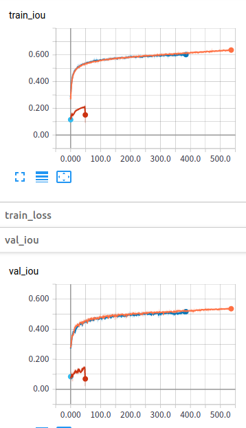

# DFANet
This repo is an unofficial pytorch implementation of DFANet:Deep Feature Aggregation for Real-Time Semantic Segmentation
# log
* 2019.4.16  After 483 epoches it rases RuntimeError: value cannot be converted to type float without overflow: (9.85073e-06,-3.2007e-06).According to the direction of the stackoverflow the error can be fixed by modifying "self.scheduler.step()" to "self.scheduler.step(loss.cpu().data.numpy())" in train.py. 
* 2019.4.24 An function has been writed to load the pretrained model which  was trained on imagenet-1k.The project of training the backbone can be Downloaded from here -https://github.com/huaifeng1993/ILSVRC2012. Limited to my computing resources(only have one RTX2080),I  trained the backbone on ILSVRC2012 with only 22 epochs.But it have a great impact on the results.

* 2019.5.23 It's hard to improve the performance of the model.May be the model's details are different from the original paper's or the hyperparameters  ....or the training strategy...or something else...

* 2020.3.7 rewrited some code of this rep which make the code more modular(model/dfanet.py).


### Installation

* pytorch==1.0.0
* python==3.6
* numpy
* torchvision
* matplotlib
* opencv-python
* tensorflow
* tensorboardX

### Dataset and pretrained model

Download CityScape dataset and unzip the dataset into `data` folder.Then run the command 'python utils/preprocess_data.py' to create labels.

### Train the network without pretrained model.
Modify your configuration in `main.py`.

```
run the command  'python main.py'
```

### curvs on CityScape set


### inference speed

|platform|input size|batch size|inference time /ms|
 -------|----------|----------|-----------------|
|rk3399|320*200|1|960|
|rk3399|200*100|1|589|
|rk3399|80*80|1|259|
|rk3399|72*72|1|161|
|2080|1024*1024|4|40|
|2080|1024*1024|1|16|
|2080|2048*1024|1|17|
|2080|2048*1024|2|39|
|2080|512*512|1|39|
|2080|512*512|16|44|

Some experimental results was provided by @ShaoqingGong
### To do

- [ ] Train the backbone xceptionA on the ImageNet-1k.

- [ ] Modify the network and improve the accuracy.

- [ ] Debug and report the performance.

- [x] Schedule the lr

- [ ] ...

### Thanks


